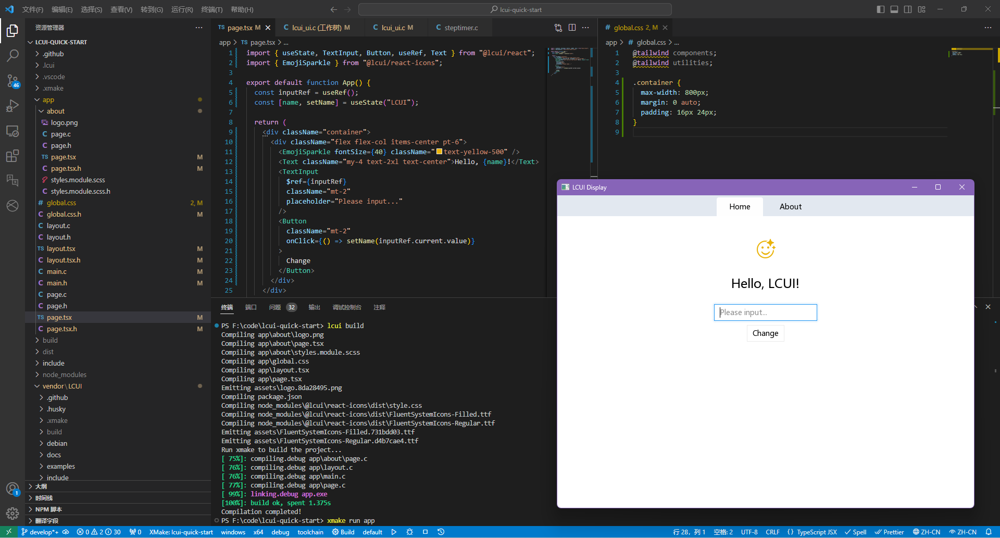

<p align="center">
  <a href="http://lcui.org/">
    
  </a>
  <h3 align="center">LCUI</h3>
  <p align="center">
    用于开发图形用户界面的 C 库
  </p>
  <p align="center">
    <a href="https://github.com/lc-soft/LCUI/actions"></a>
    <a href="https://codecov.io/gh/lc-soft/LCUI"></a>
    
    
  </p>
</p>

## 目录

<!-- TOC -->

- [目录](#%E7%9B%AE%E5%BD%95)
- [介绍](#%E4%BB%8B%E7%BB%8D)
  - [主要特性](#%E4%B8%BB%E8%A6%81%E7%89%B9%E6%80%A7)
  - [一图速览](#%E4%B8%80%E5%9B%BE%E9%80%9F%E8%A7%88)
  - [架构](#%E6%9E%B6%E6%9E%84)
- [快速体验](#%E5%BF%AB%E9%80%9F%E4%BD%93%E9%AA%8C)
- [文档](#%E6%96%87%E6%A1%A3)
  - [教程](#%E6%95%99%E7%A8%8B)
  - [参考资料](#%E5%8F%82%E8%80%83%E8%B5%84%E6%96%99)
- [路线图](#%E8%B7%AF%E7%BA%BF%E5%9B%BE)
- [贡献](#%E8%B4%A1%E7%8C%AE)
- [常见问题](#%E5%B8%B8%E8%A7%81%E9%97%AE%E9%A2%98)
- [许可](#%E8%AE%B8%E5%8F%AF)

<!-- /TOC -->

## 介绍

LCUI 是一个用 C 语言编写的用于构建图形用户界面的库。它的定位是探索和实践新的用户界面开发方式，以体积小、易于使用、提供便捷的开发工具为特点，帮助开发者快速开发带有图形用户界面的桌面端应用程序。

**LC** 源自作者名字首字母，设计之初的目的是为了方便作者开发一些小项目和积累开发经验，不过遗憾的是作者并没有因此在 C/C++ 高手众多的就业环境下获得足够竞争优势，于是只能从事 Web 前端开发工作，也正是因为如此，LCUI 现在的发展方向偏向于融合 Web 前端领域的技术。

### 主要特性

- **跨平台：** 支持 Windows、Linux。
- **全自绘组件：** 组件在多个平台中都能保持一致的外观和行为。
- **自带 CSS 引擎：** 支持使用 CSS 来定义用户界面的样式和布局，对于有网页开发经验的人比较容易上手。
- **提供现代化的开发工具：** 该工具允许你使用 [TypeScript](https://lcui-dev.github.io/docs/guide/typescript) 语言搭配 JSX 语法、 React 库以及其它 Web 前端技术来编写用户界面。

### 一图速览

你可以从下图了解 LCUI 应用程序的开发体验：



- **类 React 组件开发方式：** 用 TypeScript 语言编写界面配置文件，结合 TypeScript 的语言优势、JSX 语法特性和 LCUI React 库，你能够以简洁的代码描述界面结构、资源依赖、组件状态、数据绑定以及事件绑定。
- **多种样式编写方式：** [Tailwind CSS](https://tailwindcss.com/)、[CSS Modules](https://github.com/css-modules/css-modules)、[Sass](https://sass-lang.com/)、全局 CSS。
- **基于目录的路由定义方式：** 以文件目录的形式组织应用的各个页面，每个页面对应一个目录，目录的路径即是该页面的路由。借助内置的应用路由器，你可以轻松地实现页面之间的切换和导航，无需手动配置路由规则。
- **友好且现代的图标库：** 图标源自 [fluentui-system-icons](https://github.com/microsoft/fluentui-system-icons) 库，针对 LCUI 的特性做了部分定制，用法相似。
- **命令行开发工具：** 运行 `lcui build` 命令预处理 app 目录内的配置文件，然后生成相应的 C 源码和资源文件。

### 架构

LCUI 建立在各种库的基础之上：

- [lib/yutil](./lib/yutil): 实用工具库，提供常用的数据结构和函数。
- [lib/pandagl](./lib/pandagl): PandaGL (Panda Graphics Library) 图形库，提供字体管理、文字排版、图片读写、图形处理和渲染能力。
- [lib/css](./lib/css): CSS 解析器和选择引擎，提供 CSS 解析和选择能力。
- [lib/platform](./lib/platform): 平台库，提供跨平台统一的系统相关 API，包括消息循环、窗口管理、输入法等。
- [lib/thread](./lib/thread): 线程库，提供跨平台的多线程能力。
- [lib/timer](./ui/timer): 定时器库，提供定时执行任务的能力。
- [lib/ui](./lib/ui): UI 核心库，提供 UI 组件管理、事件队列、样式计算、绘制等 UI 必要能力。
- [lib/ui-xml](./lib/anchor): XML 解析库，提供从 XML 文件内容创建 UI 的能力。
- [lib/ui-cursor](./lib/ui-cursor): 光标，提供光标绘制能力。
- [lib/ui-server](./lib/ui-server): UI 服务器，提供将 UI 组件映射至系统窗口的能力。
- [lib/ui-router](./lib/ui-router): 路由管理器，提供路由映射和导航能力。
- [lib/ui-widgets](./lib//ui/widgets): 预置的基础组件库，提供文本、按钮、滚动条等一些基础的 UI 组件。
- [lib/worker](./lib/worker): 工作线程库，提供简单的工作线程通信和管理能力。

## 快速体验

在开始前你需要在你的计算机上安装以下软件：

- [Git](https://git-scm.com/download/)：版本管理工具，用于下载示例项目源码
- [XMake](https://xmake.io/#/zh-cn/?id=%e5%ae%89%e8%a3%85)：构建工具，用于构建项目
- [Node.js](https://nodejs.org/): JavaScript 运行环境，用于运行 LCUI 的命令行开发工具

然后在命令行窗口中运行以下命令：

```shell
# 安装 LCUI 命令行开发工具
npm install -g @lcui/cli

# 创建 LCUI 应用程序项目
lcui create my-lcui-app
```

之后按照命令输出的提示继续操作。

## 文档

- [在线文档](https://lcui-dev.github.io/docs/next/guides/base/)
- [意见征集稿（RFC）](https://lcui-dev.github.io/docs/next/rfcs/)
- [更新日志](CHANGELOG.zh-cn.md)
- [贡献指南](.github/CONTRIBUTING.md)

### 教程

- [待办清单](https://lcui-dev.github.io/docs/next/tutorials/todolist)：学习 LCUI 的基本概念和用法，以及如何使用它构建界面，并实现状态管理、界面更新和交互。
- [渲染布料动画](https://lcui-dev.github.io/docs/next/tutorials/render-fabric)：参照现有的布料模拟程序的 JavaScript 源码，以 C 语言重新编写，并采用 cairo 图形库进行布料渲染，再运用 LCUI 实现布料动画的播放和交互。
- [浏览器](https://lcui-dev.github.io/docs/next/tutorials/browser)：参照网页浏览器，用 LCUI 实现与之类似的界面结构、布局、样式和多标签管理功能，并运用 LCUI 路由管理功能实现多标签页的状态管理和导航，以及一个简单的文件浏览页面。**（该教程已过时，欢迎参与更新）**

### 参考资料

LCUI 及相关项目的部分功能设计参考了其它开源项目，你可以查看它们的文档以了解基本概念和用法。

- [DirectXTK](https://github.com/Microsoft/DirectXTK/wiki/StepTimer)：步进定时器的源码参考。
- [Vue Router](https://router.vuejs.org/zh/guide/)：路由管理器的参考，[部分功能的实现](https://github.com/search?q=repo%3Alc-soft%2FLCUI+vuejs%2Fvue-router&type=code)还参考了 Vue Router 的源码。
- [Next.js](https://nextjs.org/docs/app/building-your-application/routing)：路由定义方式的参考。

## 路线图

以下是未来可推进的事项：

- LCUI
  - 改进 API 设计。
  - 改进 CSS 引擎，增加支持 `inherit`、`!important`、转义字符。
  - 添加 [SDL](https://www.libsdl.org/) 后端，代替 lib/platform 库。
  - 适配其它开源图形库，以获得更好的渲染性能。
- 命令行工具
  - `lcui build --watch`：持续监听文件变更并自动重新构建。
  - `lcui dev-server`：与 webpack-dev-server 类似，将 LCUI 应用构建为网站以便开发者在浏览器中预览界面。
  - 添加构建缓存，仅重新构建有更改的文件。
- React 组件库：参考一些 web 前端组件库（例如：[radix](https://www.radix-ui.com/)、[shadcn/ui](https://ui.shadcn.com/)），用 TypeScript + React 开发一个适用于 LCUI 应用程序的组件库，复用 [LC Design](https://github.com/lcui-dev/lc-design) 组件库中的组件。
- 文档
  - 教程
  - 意见征集稿（RFC）

## 贡献

有很多方式可以为此项目的发展做贡献：

- 完善 lib 目录中各个库的自述文档，内容包括但不仅限于补充示例代码、相关功能讲解、运行效果图等
- [反馈问题](https://github.com/lc-soft/LCUI/issues)并在问题关闭时帮助我们验证它们是否已经修复
- 在源码中搜索 [FIXME 注释](https://github.com/lc-soft/LCUI/search?l=C&q=FIXME)和 [TODO 注释](https://github.com/lc-soft/LCUI/search?l=C&q=TODO)，然后尝试解决它们
- 在 [IssueHunt](https://issuehunt.io/r/lc-soft/LCUI) 上为感兴趣的 issue 设置悬赏，吸引其他开发者参与开发
- 审查[源代码的改动](https://github.com/lc-soft/LCUI/pulls)
- 修复已知问题

本项目采用了参与者公约定义的行为准则，该文档应用于许多开源社区，有关更多信息，请参阅[《行为准则》](CODE_OF_CONDUCT.zh-cn.md)。

## 常见问题

**这是一个浏览器内核吗？或者是像 Electron 这样的集成了浏览器环境的开发库？**

不是，你可以当成是一个应用了部分 Web 技术的传统 GUI 开发库。

**都用上 TypeScript 语言了，那我为什么不直接用 Electron？**

是的，如果你有 web 开发经验且愿意学习 Electron，显然 Electron 是最合适的选择。

以 LCUI 现有的条件，除了满足作者的个人需求外，也就只适用于开发一些简单的小工具。

**相比其它 GUI 库/框架，我为什么选择 LCUI？**

建议优先考虑其它 GUI 库/框架。

**建议添加 MacOS、Android 系统支持！**

这些特性的开发和维护成本较高，暂无相关计划。如果你迫切需要这些特性，你可以尝试实现它们，例如新建 lcui-macos 和 lcui-android 项目，然后在相关专业人员和 Chat GPT 的帮助下完成它们。

**我想要 ???? 功能，就像 ???? 里的那样。**

请先[新建 issue](https://github.com/lc-soft/LCUI/issues/new/choose)，按照已有的模板补全内容，我们建议你尽量将需求描述清楚，如果能提供开发思路、相关参考文档等内容那是最好的，例如：

```markdown
# 建议添加 xxx

（简介）xxx 是......
（特性）它能够......
（理由）对于 LCUI 它能解决 ...... 等问题
（实现思路）大致的实现方法是先这样......然后......再......最后......
（参考资料）具体可参考这些 ......
```

你也可以参考现有的[意见征集稿（RFC）](https://lcui-dev.github.io/docs/next/rfcs/)来撰写内容。

不推荐的写法：

```markdown
# 建议添加 xxx

如题，我觉得很有必要，请添加，谢谢。
```

**求添加 Python/Go/Rust/C#/Java 语言绑定！**

LCUI 的命令行开发工具已经支持将 TypeScript 写的界面配置文件编译为 C 源文件，虽然不是语言绑定但也够用，所以作者不会再添加其它语言绑定。

如果你实在需要的话可以自己动手设计，毕竟你比作者更懂这些语言的编程思想和设计哲学，也算是一个展现技术实力的好机会。

**CSS 标准的支持程度如何？**

以下列出了支持的 CSS 特性。勾选的即是支持（但并不意味着完全支持），未列出特性则默认不支持。

<details>
  <summary>CSS 特性覆盖情况</summary>

- at rules
  - [x] `@font-face`
  - [ ] `@keyframes`
  - [ ] `@media`
- keywords
  - [ ] `!important`
- selectors
  - [x] `*`
  - [x] `type`
  - [x] `#id`
  - [x] `.class`
  - [x] `:hover`
  - [x] `:focus`
  - [x] `:active`
  - [x] `:first-child`
  - [x] `:last-child`
  - [ ] `[attr="value"]`
  - [ ] `:not()`
  - [ ] `:nth-child()`
  - [ ] `parent > child`
  - [ ] `a ~ b`
  - [ ] `::after`
  - [ ] `::before`
  - [ ] ...
- units
  - [x] px
  - [x] dp
  - [x] sp
  - [x] pt
  - [x] %
  - [ ] rem
  - [ ] vh
  - [ ] vw
- properties
  - [x] top, right, bottom, left
  - [x] width, height
  - [x] visibility
  - [x] display
    - [x] none
    - [x] inline-block
    - [x] block
    - [x] flex
    - [ ] inline-flex
    - [ ] inline
    - [ ] grid
    - [ ] table
    - [ ] table-cell
    - [ ] table-row
    - [ ] table-column
    - [ ] ...
  - [x] position
    - [x] static
    - [x] relative
    - [x] absolute
    - [ ] fixed
  - [x] box-sizing
    - [x] border-box
    - [x] content-box
  - [x] border
  - [x] border-radius
  - [x] background-color
  - [x] background-image
  - [x] background-position
  - [x] background-cover
  - [ ] background
  - [x] pointer-events
  - [x] font-face
  - [x] font-family
  - [x] font-size
  - [x] font-style
  - [x] flex
  - [x] flex-shrink
  - [x] flex-grow
  - [x] flex-basis
  - [x] flex-wrap
  - [x] flex-direction
  - [x] justify-content
    - [x] flex-start
    - [x] center
    - [x] flex-end
  - [x] align-items
    - [x] flex-start
    - [x] center
    - [x] flex-end
    - [x] stretch
  - [ ] float
  - [ ] transition
  - [ ] transform
  - [ ] ...

</details>

具体的属性和值的支持情况可查看：[lib/css/src/properties.c](lib/css/src/properties.c#L177)

## 许可

[MIT](http://opensource.org/licenses/MIT)
